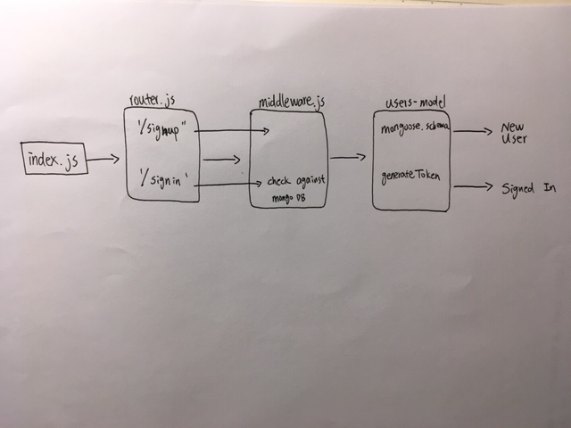

# LAB - 11

## Authentication

### Author: Student/Group Name

### Links and Resources
* [submission PR](https://github.com/davidzheng-401d32/lab-11/pull/1)
* [travis](https://travis-ci.com/davidzheng-401d32/lab-11/builds/133948580)
* [back-end](https://davidzheng-lab-11.herokuapp.com/) (when applicable)

#### Documentation
* [jsdoc](https://davidzheng-lab-11.herokuapp.com/docs) (link doesn't work)

### Setup
#### `.env` requirements
* `PORT` - 3000
* `MONGODB_URI` - mongodb://localhost:27017/db

#### Running the app
the assignment is not yet finished 
  
#### Tests
unit test: `npm test`
lint test: `npm run lint`

#### UML

